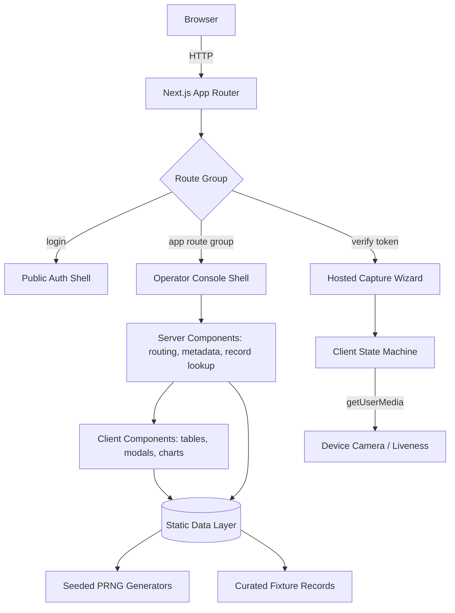

# Document KYC — Identity & Compliance Platform

A frontend-only, presentation-grade showcase of a unified identity verification, document intelligence, and anti-money-laundering platform. The application reproduces the full operator console and the end-user identification journey — dashboards, verification inboxes, evidence review, document extraction, sanctions screening, and a hosted multi-step capture wizard — driven entirely by deterministic in-memory data with **no backend dependency**.

---

## 🚀 Key Features

*   **Unified Compliance Console**: A single operator workspace spanning six product surfaces — IDV (Identity Verification), IDP (Intelligent Document Processing), AML (Anti Money Laundering), Customers, KYB (Know Your Business), and KYC (Know Your Customer) — under one persistent, collapsible navigation shell.
*   **Analytics Dashboard**: Seven live visualizations covering verification status distribution, daily processing workload, per-outcome trend lines, country and document-type breakdowns, and application source share across Web, iOS, and Android.
*   **Verification Inbox at Scale**: A 3,219-record verification ledger with server-grade client paging, free-text search, status filtering, and per-row check pills (DOC / NFC / LIV / FM / AML) that reflect individual signal outcomes rather than a single aggregate verdict.
*   **Forensic Evidence Review**: Verification detail views present a media rail of selfie, liveness frames, and document captures alongside a field-by-field **MRZ vs. Visual vs. NFC** reconciliation table with per-field match indicators and a weighted Checks Summary.
*   **Document Intelligence Workspace**: Dual extraction engines — *Nexus Layout* for free-form layout analysis and *Template Sentinel* for template-matched forms — with a four-format result viewer (Markdown, Text, Table, Barcode) and a slide-in AI Agents panel.
*   **Sanctions & Adverse Media Screening**: A 43,157-result AML transaction ledger with fuzziness-tiered matching, bulk selection, per-entity monitoring toggles, manual lookup, and drill-down case pages resolving to candidate profiles with relevance and jurisdiction metadata.
*   **Hosted Identification Wizard**: A standalone, unbranded-shell capture journey served on a tokenized public route, opened in a new tab from a generated shareable link — covering consent, ID type selection, capture-method handoff, two-sided document upload, live camera liveness, and completion.
*   **Deterministic Static Data Layer**: All records are synthesized at runtime from a fixed-seed PRNG, so paging, filtering, and drill-down behave like a real dataset while remaining byte-identical across reloads, machines, and demo sessions.

---

## 📐 System Architecture

The platform is a single-tier Next.js App Router application. Every surface that would ordinarily call a service is instead bound to a typed, deterministic data module, keeping the showcase fully self-contained:



### Technical Stack
1.  **Framework**: Next.js 16 (App Router, Turbopack) with React 19 Server and Client Components.
2.  **Language**: TypeScript 5 in strict mode, with zero `any` and no suppressed diagnostics across the source tree.
3.  **Styling**: Tailwind CSS v4 using the CSS-first `@theme` directive, driven by a nine-step brand palette exposed as CSS custom properties.
4.  **Visualization**: Recharts 3 composed charts — stacked area, composed bar-plus-line, categorical bar, and pie — with mount animations disabled for deterministic rendering.
5.  **Iconography**: `lucide-react`, plus hand-authored inline SVG for document, portrait, and identity-card artwork.
6.  **Data**: Local TypeScript modules under `src/lib/data`, generated at module initialization — no network, database, or environment configuration.

---

## ⚙️ Advanced Engineering & Deep Dive

This section details the internal mechanics of the rendering, data, and interaction layers.

### 1. Deterministic Data Synthesis
The showcase must present dataset-scale behaviour without shipping a dataset, so records are generated rather than stored:
* **Seeded PRNG**: A 32-bit integer-hash generator (`createRng`) replaces `Math.random` throughout. Every consumer draws from a fixed seed, guaranteeing that record #2,847 on page 114 is identical on every machine, in every session, and in every screenshot.
* **Weighted Distributions**: Outcomes are sampled through `pickWeighted`, reproducing the reference status mix — 38% rejected, 29% passed, 17% warning, 16% pending — rather than a flat random spread, so aggregate figures on the dashboard remain coherent with the underlying rows.
* **Temporal Coherence**: Timestamps are produced by walking a cursor backwards from a fixed epoch in randomized intervals, which yields a strictly newest-first ledger with naturalistic clustering instead of uniformly spaced entries.
* **Signal-Aware Check Synthesis**: Per-row verification pills are derived from the row's own status and document class — passport-only scans emit a document check alone, while identity-card flows conditionally include NFC, and rejected rows mix passed and failed signals rather than failing uniformly.

### 2. Rendering Strategy & Server/Client Boundary
The application deliberately splits responsibilities to keep interactive bundles small:
* **Server Components** own routing, per-route metadata, parameter resolution via the async `params` promise, record lookup, and `notFound()` handling.
* **Client Components** are isolated to the surfaces that genuinely need state — sortable and paginated tables, modal state machines, chart containers, drawer transitions, and the capture wizard.
* **Static vs. Dynamic**: Index and informational routes are prerendered as static content at build time; parameterized detail routes (`/idv/[id]`, `/aml/[id]`, `/idp/[id]`, `/verify/[token]`) are server-rendered on demand.

### 3. Hosted Identification Wizard
The public capture journey at `/verify/[token]` is implemented as an explicit finite state machine over nine steps:
* **Flow Control**: States advance through `intro → idType → uploadMethod → (qr) → front → back → liveness → verifying → done`, with the back step conditionally skipped for passports, which are single-sided.
* **Link Generation**: The operator's "Create a new profile request" modal mints an opaque session token and produces a shareable URL, launching the wizard in an isolated browser tab exactly as a real hosted flow would.
* **Live Camera Integration**: The liveness step requests the device camera through `getUserMedia` with a `user`-facing constraint, attaches the stream to a video element, and tears down all tracks on unmount. Permission denial degrades to a neutral placeholder rather than blocking the journey.
* **Isolated Presentation**: The wizard renders under its own route-level layout with a distinct multi-radial-gradient background and no operator chrome, so the end-user experience is visually independent from the console.

### 4. Composite Data Visualization
The dashboard renders seven charts sharing a single visual language:
* **Composed Charts**: Rejection trends overlay a bar series with a monotone line on shared axes to express both discrete daily volume and smoothed trajectory simultaneously.
* **Stacked Area Workload**: Daily processing volume stacks four outcome series with graduated fill opacities, preserving legibility where bands overlap.
* **Deterministic Rendering**: Mount animations are disabled on every series, so charts paint fully on first frame — essential for reproducible screenshots, PDF export, and headless capture.
* **Shared Axis Contract**: A common axis configuration and tooltip style object is applied across all charts to hold typography, tick density, and elevation consistent.

### 5. Interaction & Component System
A small set of primitives underpins every surface:
* **Modal Infrastructure**: A single `Modal` primitive handles focus containment, escape-key dismissal, body scroll locking, and backdrop click-out, with entry animations defined as CSS keyframes rather than a runtime animation library.
* **Multi-Step Modals**: The Add Verification dialog is itself a two-phase state machine — request configuration, then link generation — resetting its internal phase only after the close transition completes, so the user never sees it revert.
* **Windowed Pagination**: A shared `Pagination` component computes an elided page window (`1 2 3 … 127 128 129`) and drives both page size and page index for every ledger in the application.
* **Synthetic Media**: Because no captured biometric or document imagery exists, evidence thumbnails, portraits, ghost portraits, identity cards, and permits are rendered as parameterized inline SVG, preserving layout fidelity without placeholder bitmaps.

---

## 🗺️ Route Map

| Route | Rendering | Description |
| --- | --- | --- |
| `/` | Static | Redirects to the authentication screen |
| `/login` | Static | Credential entry against a full-bleed brand backdrop |
| `/dashboard` | Static | Product switcher, KPI strip, and seven analytics charts |
| `/idv` · `/idv/[id]` | Static · Dynamic | Verification ledger and forensic evidence review |
| `/idp` · `/idp/[id]` | Static · Dynamic | Document scan history and multi-format extraction viewer |
| `/idp/template/[id]` | Dynamic | Template-matched extraction with confidence scoring |
| `/aml` · `/aml/[id]` | Static · Dynamic | Screening ledger and candidate case resolution |
| `/customers` | Static | Tenant directory with cloud and on-premises provisioning |
| `/kyb` | Static | Business case overview with risk scoring |
| `/kyc` · `/kyc/[id]` | Static · Dynamic | KYC ledger and detail with personal profile panel |
| `/verify/[token]` | Dynamic | Hosted end-user identification wizard |
| `/docs` · `/component` · `/help` · `/profile` · `/settings` | Static | Supporting informational surfaces |

---

## 🛠️ Getting Started

**Prerequisites** — Node.js 20 or later and npm.

```bash
# Install dependencies
npm install

# Start the development server
npm run dev

# Produce and serve an optimized production build
npm run build
npm start

# Static analysis
npm run lint
```

The application is served at `http://localhost:3000` and redirects to the login screen. Credentials are prefilled and accepted unconditionally — submitting the form enters the console directly.

> **Camera access**: The liveness step of the hosted wizard requests the device camera. Browsers restrict `getUserMedia` to secure contexts, which includes `localhost`. If access is declined, the step falls back to a placeholder and the journey continues uninterrupted.

---

## 📂 Project Structure

```
src/
├── app/
│   ├── (app)/              # Operator console route group (shared sidebar shell)
│   │   ├── dashboard/      # Analytics surface and chart composition
│   │   ├── idv/  kyc/      # Verification ledgers and detail routes
│   │   ├── idp/            # Document intelligence, incl. template extraction
│   │   ├── aml/            # Screening ledger and case resolution
│   │   ├── customers/      # Tenant directory and provisioning modals
│   │   └── kyb/            # Business verification overview
│   ├── login/              # Public authentication screen
│   └── verify/[token]/     # Hosted identification wizard (isolated layout)
├── components/
│   ├── brand/              # Wordmark and compact mark
│   ├── layout/             # Application shell and navigation
│   ├── ui/                 # Modal, Card, Badge, Pagination, Flag primitives
│   ├── verification/       # Ledger table, detail view, evidence media
│   ├── idp/  verify/       # Document and capture-flow illustrations
│   └── charts/             # Shared chart legend
└── lib/
    ├── data/               # Typed static data modules per product surface
    ├── seed.ts             # Deterministic PRNG and sampling helpers
    └── format.ts           # Date, time, and axis formatting
```

---

## 🎨 Theming & Extension

* **Brand Palette**: Nine brand steps are declared as CSS custom properties in `src/app/globals.css` and surfaced to Tailwind through `@theme inline`. Recolouring the entire application is a single-block edit.
* **Wordmark**: `src/components/brand/Logo.tsx` renders both the full wordmark and the compact mark used when the sidebar collapses — no raster assets are involved.
* **Content**: Every record, label, and fixture lives under `src/lib/data`. Adjusting demo content requires no component changes.
* **Backend Adoption**: Because each data module exports plainly typed collections, swapping the static layer for live API calls is a module-level substitution — component contracts remain unchanged.

---

## 🔒 Security Compliance

* **Zero Backend Surface**: The build contains no API routes, database drivers, credentials, or outbound network calls. There is no server-side attack surface beyond static asset delivery.
* **No Real Personal Data**: All names, document numbers, MRZ strings, addresses, and contact details are fabricated for demonstration. No genuine identity documents or biometric captures are stored or transmitted.
* **Ephemeral Media Handling**: Files selected in upload steps are never read, uploaded, or persisted — only the filename is retained in component state for visual feedback. Camera streams exist purely in-memory and every track is explicitly stopped on unmount.
* **Zero Hardcoded Brand Identifiers**: Brand naming, palette, and marks are centralized in the theme and logo modules, allowing white-label redeployment without touching feature code.
* **Deterministic & Auditable Output**: Fixed-seed generation means the rendered dataset is fully reproducible, so any demo or screenshot can be regenerated exactly for review.
